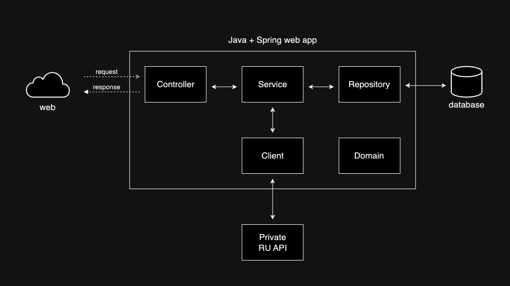

<h1 > API RU UFG 🍲</h1>

A Web Api that allow the academic community to make integrations with the University Restaurant data.

---

## Table of Contents

- [Requirements](#requirements)
- [System Design](#system-design)

---

## Requirements

- **The system must allow users to:**

  - **[Request for the today's menu for each meal]**
  - **[Request all today meals]**
  - **[Request the week meals]**
  - **[Request the meals of a specific date]**

- **User Stories**:
  - \*As a user, I want to **[make a request for today meals]**, so that I can **[integrate with my application]\***.
  - \*As a user, I want to **[make a request for the meals on January 25th 2025]**, so that I can **[integrate with my application]\***.

---

## System Design

The project has an architecture similar to a layered architecture.

### Architecture Overview

- **System Components**:
  - Backend: _Java Srping Boot for API development_
  - Database: _PostgreSQL_
  - Deploy: _AWS_

### Design Diagrams

- **High-Level Architecture**

- **ERD (Entity-Relationship Diagram)**

  - Example: Database schema (if applicable)

---
